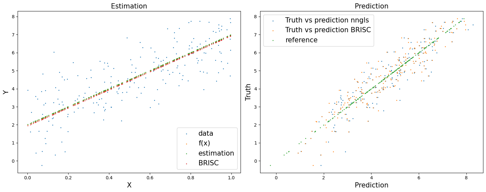
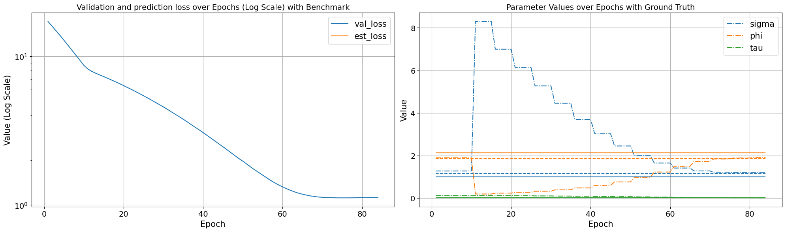

```python
%load_ext autoreload
%autoreload 2
```


```python
import rpy2.robjects as robjects
from rpy2.robjects.packages import importr
BRISC = importr('BRISC')
def BRISC_estimation(residual, X, coord):
    residual_r = robjects.FloatVector(residual)
    coord_r = robjects.FloatVector(coord.transpose().reshape(-1))
    coord_r = robjects.r['matrix'](coord_r, ncol=2)

    if X is None:
        res = BRISC.BRISC_estimation(coord_r, residual_r)
    else:
        Xr = robjects.FloatVector(X.transpose().reshape(-1))
        Xr = robjects.r['matrix'](Xr, ncol=X.shape[1])
        res = BRISC.BRISC_estimation(coord_r, residual_r, Xr)

    theta_hat = res[9]
    beta = res[8]
    beta = np.array(beta)
    theta_hat = np.array(theta_hat)
    phi = theta_hat[2]
    tau_sq = theta_hat[1]
    sigma_sq = theta_hat[0]
    theta_hat[1] = phi
    theta_hat[2] = tau_sq / sigma_sq

    return beta, theta_hat
```


```python
import torch
import geospaNN
import numpy as np
import time
import pandas as pd
import seaborn as sns
import matplotlib.pyplot as plt
```


```python
def f5(X): return (10*np.sin(np.pi*X[:,0]*X[:,1]) + 20*(X[:,2]-0.5)**2 + 10*X[:,3] +5*X[:,4])/6
def f1(X): return 5*X + 2

sigma = 1
phi = 3
tau = 0.01
theta = torch.tensor([sigma, phi / np.sqrt(2), tau])

p = 1; funXY = f1

n = 1000
nn = 20
batch_size = 50

torch.manual_seed(2024)
X, Y, coord, cov, corerr = geospaNN.Simulation(n, p, nn, funXY, theta, range=[0, 10])

X, Y, coord, _ = geospaNN.spatial_order(X, Y, coord, method = 'max-min')
data = geospaNN.make_graph(X, Y, coord, nn)

torch.manual_seed(2024)
np.random.seed(0)
data_train, data_val, data_test = geospaNN.split_data(X, Y, coord, neighbor_size = nn, 
                                                   test_proportion = 0.2)
```


```python
torch.manual_seed(2024)
mlp_nn = torch.nn.Sequential(
    torch.nn.Linear(p, 1)
)
nn_model = geospaNN.nn_train(mlp_nn, lr =  0.01, min_delta = 0.001)
training_log = nn_model.train(data_train, data_val, data_test)
theta0 = geospaNN.theta_update(torch.tensor([1, 1.5, 0.01]), mlp_nn(data_train.x).squeeze() - data_train.y, data_train.pos, neighbor_size = 20)
mlp_nngls = torch.nn.Sequential(
    torch.nn.Linear(p, 1),
)
model = geospaNN.nngls(p=p, neighbor_size=nn, coord_dimensions=2, mlp=mlp_nngls, theta=torch.tensor(theta0))
nngls_model = geospaNN.nngls_train(model, lr =  0.01, min_delta = 0.001)
training_log = nngls_model.train(data_train, data_val, data_test,
                                 Update_init = 10, Update_step = 5)
```

    Theta updated from
    [1.   1.5  0.01]
    Theta updated from
    [1.2714003  1.89249914 0.11636965]
    to
    [8.28898276 0.19122626 0.11904745]
    Theta updated from
    [8.28898276 0.19122626 0.11904745]
    to
    [6.99168522 0.23228389 0.11687287]
    Theta updated from
    [6.99168522 0.23228389 0.11687287]
    to
    [6.12525639 0.27047986 0.10956298]
    Theta updated from
    [6.12525639 0.27047986 0.10956298]
    to
    [5.26639589 0.32092605 0.10179605]
    Theta updated from
    [5.26639589 0.32092605 0.10179605]
    to
    [4.45536997 0.38688547 0.09374227]
    Theta updated from
    [4.45536997 0.38688547 0.09374227]
    to
    [3.69556335 0.47626894 0.08536871]
    Theta updated from
    [3.69556335 0.47626894 0.08536871]
    to
    [3.02207465 0.59644983 0.07659992]
    Theta updated from
    [3.02207465 0.59644983 0.07659992]
    to
    [2.44732479 0.75884009 0.06718273]
    Theta updated from
    [2.44732479 0.75884009 0.06718273]
    to
    [1.99102496 0.96820214 0.0565409 ]
    Theta updated from
    [1.99102496 0.96820214 0.0565409 ]
    to
    [1.64774011 1.22312618 0.04477572]
    Theta updated from
    [1.64774011 1.22312618 0.04477572]
    to
    [1.41049225 1.49623259 0.03291362]
    Theta updated from
    [1.41049225 1.49623259 0.03291362]
    to
    [1.27416592 1.71684432 0.02340899]
    Theta updated from
    [1.27416592 1.71684432 0.02340899]
    to
    [1.21404291 1.83882309 0.0170868 ]
    Theta updated from
    [1.21404291 1.83882309 0.0170868 ]
    to
    [1.19619055 1.88436302 0.0131272 ]
    Theta updated from
    [1.19619055 1.88436302 0.0131272 ]
    to
    [1.19376909 1.89770586 0.01086118]
    Epoch 00081: reducing learning rate of group 0 to 5.0000e-03.
    INFO: Early stopping
    End at epoch84


```python
X_train = np.concatenate([data_train.x.detach().numpy(), data_val.x.detach().numpy()], axis = 0)
n_train = X_train.shape[0]
X_train_int = np.concatenate((X_train, np.repeat(1, n_train).reshape(n_train, 1)), axis=1)
n_test = data_test.x.shape[0]
X_test_int = torch.concatenate((data_test.x, torch.from_numpy(np.repeat(1, n_test).reshape(n_test, 1))), axis=1)
Y_train = np.concatenate([data_train.y.detach().numpy(), data_val.y.detach().numpy()], axis = 0)
coord_train = np.concatenate([data_train.pos.detach().numpy(), data_val.pos.detach().numpy()], axis = 0)
```


```python
torch.manual_seed(2024)
np.random.seed(2024)
beta, theta_hat_linear = BRISC_estimation(Y_train, X_train_int, coord_train)
def model_BRISC(X, edge_index = 0):
    if isinstance(X, np.ndarray):
        X = torch.from_numpy(X).float()
    return(torch.matmul(X, torch.from_numpy(beta).float()))
theta_hat_linear
```

    ---------------------------------------- 
    	Ordering Coordinates 
    ----------------------------------------
    	Model description
    ----------------------------------------
    BRISC model fit with 800 observations.
    
    Number of covariates 2 (including intercept if specified).
    
    Using the exponential spatial correlation model.
    
    Using 15 nearest neighbors.
    
    
    
    Source not compiled with OpenMP support.
    ----------------------------------------
    	Building neighbor index
    ----------------------------------------
    	Performing optimization
    ----------------------------------------
    	Processing optimizers
    ----------------------------------------


    array([1.16544065, 1.85772445, 0.01273631])


```python
#### A one line function for prediction for nn-gls model
test_predict_nngls = model.predict(data_train, data_test)
#### Prediction for BRISC linear model
w_test = geospaNN.krig_pred(torch.from_numpy(Y_train) - model_BRISC(X_train_int), torch.from_numpy(coord_train), data_test.pos, theta_hat_linear)[0]
test_predict_BRISC = w_test + model_BRISC(X_test_int)

fig, axes = plt.subplots(1, 2, figsize=(15, 6))
axes[0].scatter(data_test.x.detach().numpy(), data_test.y.detach().numpy(), s = 1, label = 'data')
axes[0].scatter(data_test.x.detach().numpy(), funXY(data_test.x.detach().numpy()), s = 1, label = 'f(x)')
axes[0].scatter(data_test.x.detach().numpy(), mlp_nngls(data_test.x).detach().numpy(), s = 1, label = 'estimation')
axes[0].scatter(data_test.x.detach().numpy(), model_BRISC(X_test_int).detach().numpy(), s = 1, label = 'BRISC')
#axes[0].scatter(data_test.x.detach().numpy(), test_predict.detach().numpy(), s = 1, label = 'prediction')
axes[0].set_xlabel('X', fontsize=15)
axes[0].set_ylabel('Y', fontsize=15)
axes[0].set_title('Estimation', fontsize=15)
axes[0].legend(prop={'size': 15})

axes[1].scatter(test_predict_nngls.detach().numpy(), data_test.y.detach().numpy(), s = 1, label = 'Truth vs prediction nngls')
axes[1].scatter(test_predict_BRISC.detach().numpy(), data_test.y.detach().numpy(), s = 1, label = 'Truth vs prediction BRISC')
axes[1].scatter(data_test.y.detach().numpy(), data_test.y.detach().numpy(), s = 1, label = 'reference')
axes[1].set_xlabel("Prediction", fontsize=15)
axes[1].set_ylabel("Truth", fontsize=15)
axes[1].set_title('Prediction', fontsize=15)
axes[1].legend(prop={'size': 15})
plt.tight_layout()
```


    

    


```python
epoch = len(training_log["val_loss"])
training_log["epoch"] = list(range(1, epoch + 1))
training_log["est_loss"] = None
training_log = pd.DataFrame(training_log)


# Melting the dataframe to make it suitable for seaborn plotting
training_log_melted = training_log[["epoch", "val_loss", "est_loss"]].melt(id_vars='epoch', var_name='Variable', value_name='Value')

# Finding the color used for the 'metric' in the plot
palette = sns.color_palette()
metric_color = palette[1]  # Assuming 'metric' is the second line in the plot

# Plotting with seaborn
# Creating two subplots side by side
fig, axes = plt.subplots(1, 2, figsize=(20, 6))
sns.lineplot(ax=axes[0], data=training_log_melted, x='epoch', y='Value', hue='Variable', style='Variable', markers=False, dashes=False)

axes[0].set_title('Validation and prediction loss over Epochs (Log Scale) with Benchmark', fontsize=14)
axes[0].set_xlabel('Epoch', fontsize=15)
axes[0].set_ylabel('Value (Log Scale)', fontsize=15)
axes[0].set_yscale('log')
axes[0].legend(prop={'size': 15})
axes[0].tick_params(labelsize=14)
axes[0].grid(True)

# Second plot (sigma, phi, tau)
kernel_params_melted = training_log[["epoch", "sigma", "phi", "tau"]].melt(id_vars='epoch', var_name='Variable', value_name='Value')
ground_truth = {'sigma': sigma, 'phi': phi/np.sqrt(2), 'tau': tau}
sns.lineplot(ax=axes[1], data=kernel_params_melted, x='epoch', y='Value', hue='Variable', style='Variable', markers=False, dashes=False, linestyle='dashdot')
palette = sns.color_palette()
for i, (param, gt_value) in enumerate(ground_truth.items()):
    axes[1].hlines(y=gt_value, xmin=1, xmax=epoch, color=palette[i], linestyle='solid')
    axes[1].hlines(y=theta_hat_linear[i], xmin=1, xmax=epoch, color=palette[i], linestyle='dashed')
palette = sns.color_palette()
axes[1].set_title('Parameter Values over Epochs with Ground Truth', fontsize=14)
axes[1].set_xlabel('Epoch', fontsize=15)
axes[1].set_ylabel('Value', fontsize=15)
axes[1].legend(prop={'size': 15})
axes[1].tick_params(labelsize=14)
axes[1].grid(True)

plt.tight_layout()
```


    

    


```python

```
