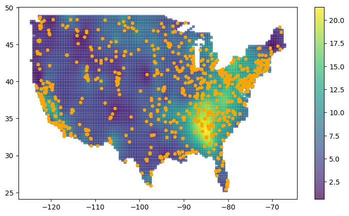
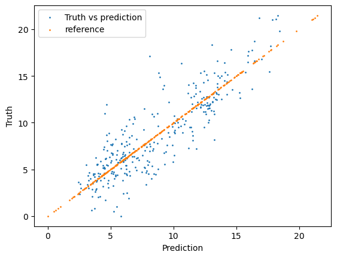
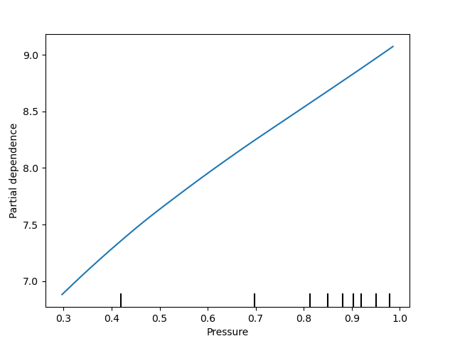
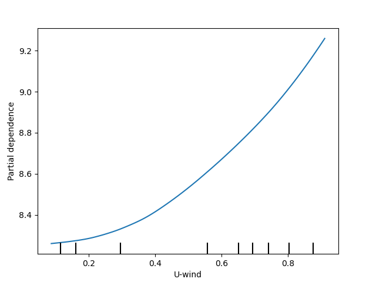
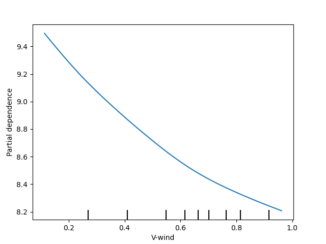

```python
%load_ext autoreload
%autoreload 2
```

```python
import torch
import geospaNN
import numpy as np
import time
import pandas as pd
import seaborn as sns
import matplotlib.pyplot as plt
import matplotlib.image as img 
import geopandas as gpd
from shapely.geometry import Point
from scipy import spatial, interpolate
import warnings
warnings.filterwarnings("ignore")
```


```python
url = "https://www2.census.gov/geo/tiger/GENZ2018/shp/cb_2018_us_nation_20m.zip"
us = gpd.read_file(url).explode()
us = us.loc[us.geometry.apply(lambda x: x.exterior.bounds[2])<-60]
```


```python
df_covariates = pd.read_csv('./data/covariate0605.csv')
df_pm25 = pd.read_csv('./data/pm25_0605.csv')
df_pm25 = df_pm25.loc[df_pm25.Latitude < 50]

x_min,y_min,x_max,y_max = np.array([np.min(df_covariates['long']), np.min(df_covariates['lat']),
    np.max(df_covariates['long']), np.max(df_covariates['lat'])])
arr1 = np.mgrid[x_min:x_max:101j, y_min:y_max:101j]

# extract the x and y coordinates as flat arrays
arr1x = np.ravel(arr1[0])
arr1y = np.ravel(arr1[1])
# using the X and Y columns, build a dataframe, then the geodataframe
df = pd.DataFrame({'X':arr1x, 'Y':arr1y})
df['coords'] = list(zip(df['X'], df['Y']))
df['coords'] = df['coords'].apply(Point)

gdf = gpd.GeoDataFrame(df, geometry=gpd.points_from_xy(x=df.X, y=df.Y),crs = us.crs)
inUS = gdf['geometry'].apply(lambda s: s.within(us.geometry.unary_union))
```


```python
lonlat_pm25=df_pm25.values[:,[1,2]]
near = df_covariates.values[:,[1,2]]
tree = spatial.KDTree(list(zip(near[:,0].ravel(), near[:,1].ravel())))
idx = tree.query(lonlat_pm25)[1]
df_pm25_mean = df_pm25.assign(neighbor = idx).groupby('neighbor')['PM25'].mean()
idx_new = df_pm25_mean.index.values
pm25 = df_pm25_mean.values
z = pm25[:,None]

lon = df_covariates.values[:,1]
lat = df_covariates.values[:,2]

f = interpolate.Rbf(lon[idx_new], lat[idx_new], z, function = 'inverse')
x_test = gdf.loc[inUS,:].X
y_test = gdf.loc[inUS,:].Y
z_test = f(x_test, y_test)
```


```python
plt.clf()
fig, ax = plt.subplots(figsize=(9, 5))
c = ax.scatter(x = x_test, y = y_test, s = 10, c = z_test, marker = 's', alpha = 0.7)
ax.plot(np.array(df_pm25['Longitude']), np.array(df_pm25['Latitude']), 'o', c = 'orange', markersize = 4)
ax.set_title('')
fig.colorbar(c, ax=ax)
plt.show()
```


    <Figure size 640x480 with 0 Axes>


    


```python
import numpy as np

lon = df_covariates.values[:, 1]
lat = df_covariates.values[:, 2]
covariates = df_covariates.values[:, 3:]
normalized_lon = (lon - min(lon)) / (max(lon) - min(lon))
normalized_lat = (lat - min(lat)) / (max(lat) - min(lat))
normalized_x_test = (x_test - min(lon)) / (max(lon) - min(lon))
normalized_y_test = (y_test - min(lat)) / (max(lat) - min(lat))

s_obs = np.vstack((normalized_lon[idx_new], normalized_lat[idx_new])).T
X = covariates[idx_new, :]
normalized_X = X
for i in range(X.shape[1]):
    normalized_X[:, i] = (X[:, i] - min(X[:, i])) / (max(X[:, i]) - min(X[:, i]))

X = normalized_X
Y = z.reshape(-1)
coord = s_obs
data = np.concatenate([X, Y.reshape(-1,1), coord], axis = 1)
#columns = ['precipitation', 'temperature', 'air pressure', 'relative humidity', 'U-wind', 'V-wind',
#          'PM 2.5', 'longitude', 'latitude']
#df = pd.DataFrame(data=data, index=range(data.shape[0]), columns=columns)
#df.to_csv('./data/Normalized_PM2.5_20190605.csv')
```


```python
data_PM25 = pd.read_csv("./data/Normalized_PM2.5_20190605.csv")
data_PM25
```


<div>
<style scoped>
    .dataframe tbody tr th:only-of-type {
        vertical-align: middle;
    }

    .dataframe tbody tr th {
        vertical-align: top;
    }

    .dataframe thead th {
        text-align: right;
    }
</style>
<table border="1" class="dataframe">
  <thead>
    <tr style="text-align: right;">
      <th></th>
      <th>Unnamed: 0</th>
      <th>precipitation</th>
      <th>temperature</th>
      <th>air pressure</th>
      <th>relative humidity</th>
      <th>U-wind</th>
      <th>V-wind</th>
      <th>PM 2.5</th>
      <th>longitude</th>
      <th>latitude</th>
    </tr>
  </thead>
  <tbody>
    <tr>
      <th>0</th>
      <td>0</td>
      <td>0.008044</td>
      <td>0.362296</td>
      <td>0.887664</td>
      <td>0.774197</td>
      <td>0.868530</td>
      <td>0.781498</td>
      <td>5.020834</td>
      <td>0.980311</td>
      <td>0.906268</td>
    </tr>
    <tr>
      <th>1</th>
      <td>1</td>
      <td>0.005516</td>
      <td>0.355305</td>
      <td>0.882153</td>
      <td>0.751742</td>
      <td>0.864206</td>
      <td>0.770715</td>
      <td>3.837500</td>
      <td>0.983093</td>
      <td>0.889762</td>
    </tr>
    <tr>
      <th>2</th>
      <td>2</td>
      <td>0.000000</td>
      <td>0.335323</td>
      <td>0.928359</td>
      <td>0.714189</td>
      <td>0.697080</td>
      <td>0.813224</td>
      <td>2.041666</td>
      <td>0.974238</td>
      <td>0.814722</td>
    </tr>
    <tr>
      <th>3</th>
      <td>3</td>
      <td>0.000000</td>
      <td>0.338579</td>
      <td>0.954218</td>
      <td>0.690767</td>
      <td>0.625266</td>
      <td>0.868161</td>
      <td>3.669444</td>
      <td>0.976951</td>
      <td>0.798275</td>
    </tr>
    <tr>
      <th>4</th>
      <td>4</td>
      <td>0.002528</td>
      <td>0.293827</td>
      <td>0.893599</td>
      <td>0.685830</td>
      <td>0.688808</td>
      <td>0.842395</td>
      <td>1.020833</td>
      <td>0.945193</td>
      <td>0.800337</td>
    </tr>
    <tr>
      <th>...</th>
      <td>...</td>
      <td>...</td>
      <td>...</td>
      <td>...</td>
      <td>...</td>
      <td>...</td>
      <td>...</td>
      <td>...</td>
      <td>...</td>
      <td>...</td>
    </tr>
    <tr>
      <th>600</th>
      <td>600</td>
      <td>0.393932</td>
      <td>0.901079</td>
      <td>0.972022</td>
      <td>0.910279</td>
      <td>0.642436</td>
      <td>0.469410</td>
      <td>5.168750</td>
      <td>0.469337</td>
      <td>0.101640</td>
    </tr>
    <tr>
      <th>601</th>
      <td>601</td>
      <td>0.000689</td>
      <td>0.810329</td>
      <td>0.897414</td>
      <td>0.539392</td>
      <td>0.553265</td>
      <td>0.464926</td>
      <td>6.041666</td>
      <td>0.436702</td>
      <td>0.098054</td>
    </tr>
    <tr>
      <th>602</th>
      <td>602</td>
      <td>0.294415</td>
      <td>0.882501</td>
      <td>0.972022</td>
      <td>0.822590</td>
      <td>0.642248</td>
      <td>0.469353</td>
      <td>8.704166</td>
      <td>0.468665</td>
      <td>0.090378</td>
    </tr>
    <tr>
      <th>603</th>
      <td>603</td>
      <td>0.011492</td>
      <td>0.811830</td>
      <td>0.965240</td>
      <td>0.719028</td>
      <td>0.676463</td>
      <td>0.512429</td>
      <td>8.725000</td>
      <td>0.460179</td>
      <td>0.035680</td>
    </tr>
    <tr>
      <th>604</th>
      <td>604</td>
      <td>0.256952</td>
      <td>0.775792</td>
      <td>0.975837</td>
      <td>0.802168</td>
      <td>0.696516</td>
      <td>0.509137</td>
      <td>8.213636</td>
      <td>0.470595</td>
      <td>0.032926</td>
    </tr>
  </tbody>
</table>
<p>605 rows × 10 columns</p>
</div>


```python
X = torch.from_numpy(data_PM25[['precipitation', 'temperature', 'air pressure', 'relative humidity', 'U-wind', 'V-wind']].to_numpy()).float()
Y = torch.from_numpy(data_PM25[['PM 2.5']].to_numpy().reshape(-1)).float()
coord = torch.from_numpy(data_PM25[['longitude', 'latitude']].to_numpy()).float()

p = X.shape[1]

n = X.shape[0]
nn = 20
batch_size = 50

X, Y, coord, _ = geospaNN.spatial_order(X, Y, coord, method = 'max-min')
data = geospaNN.make_graph(X, Y, coord, nn)

torch.manual_seed(2024)
np.random.seed(0)
data_train, data_val, data_test = geospaNN.split_data(X, Y, coord, neighbor_size = 20, 
                                                   test_proportion = 0.5)
```


```python
start_time = time.time()
mlp_nn = torch.nn.Sequential(
    torch.nn.Linear(p, 50),
    torch.nn.ReLU(),
    torch.nn.Linear(50, 20),
    torch.nn.ReLU(),
    torch.nn.Linear(20, 1),
)
nn_model = geospaNN.nn_train(mlp_nn, lr =  0.01, min_delta = 0.001)
training_log = nn_model.train(data_train, data_val, data_test)
```

    Epoch 00031: reducing learning rate of group 0 to 5.0000e-03.


```python
theta0 = geospaNN.theta_update(torch.tensor([1, 1.5, 0.01]), mlp_nn(data_train.x).squeeze() - data_train.y, data_train.pos, neighbor_size = 20)
mlp_nngls = torch.nn.Sequential(
    torch.nn.Linear(p, 100),
    torch.nn.ReLU(),
    torch.nn.Linear(100, 50),
    torch.nn.ReLU(),
    torch.nn.Linear(50, 20),
    torch.nn.ReLU(),
    torch.nn.Linear(20, 10),
    torch.nn.ReLU(),
    torch.nn.Linear(10, 1),
)
model = geospaNN.nngls(p=p, neighbor_size=nn, coord_dimensions=2, mlp=mlp_nngls, theta=torch.tensor(theta0))
nngls_model = geospaNN.nngls_train(model, lr =  0.01, min_delta = 0.001)
training_log = nngls_model.train(data_train, data_val, data_test,
                                 Update_init = 20, Update_step = 10)
end_time = time.time()
```

    Theta updated from
    [1.   1.5  0.01]
    Epoch 00020: reducing learning rate of group 0 to 5.0000e-03.
    Theta updated from
    [10.29591688 10.3716713   0.20216037]
    to
    [11.32370202  8.14642528  0.15268137]
    Epoch 00029: reducing learning rate of group 0 to 2.5000e-03.
    Theta updated from
    [11.32370202  8.14642528  0.15268137]
    to
    [10.57182313  8.82062549  0.15966506]
    INFO: Early stopping
    End at epoch32


```python
print(f"\rRunning time: {end_time - start_time} seconds")
```

    Running time: 7.1364500522613525 seconds


```python
[test_predict, test_U, test_L] = model.predict(data_train, data_test, CI = True)
plt.clf()
plt.scatter(test_predict.detach().numpy(), data_test.y.detach().numpy(), s = 1, label = 'Truth vs prediction')
plt.scatter(data_test.y.detach().numpy(), data_test.y.detach().numpy(), s = 1, label = 'reference')
plt.xlabel("Prediction")
plt.ylabel("Truth")
plt.legend()
plt.show()
```


    

    


```python
f_pred = interpolate.CloughTocher2DInterpolator(list(zip(data_test.pos.detach().numpy()[:,0], 
                                                data_test.pos.detach().numpy()[:,1])),
                                                test_predict.detach().numpy())
f_U = interpolate.CloughTocher2DInterpolator(list(zip(data_test.pos.detach().numpy()[:,0], 
                                                data_test.pos.detach().numpy()[:,1])),
                                                test_U.detach().numpy())
f_L = interpolate.CloughTocher2DInterpolator(list(zip(data_test.pos.detach().numpy()[:,0], 
                                                data_test.pos.detach().numpy()[:,1])),
                                                test_L.detach().numpy())
f_true = interpolate.CloughTocher2DInterpolator(list(zip(data_test.pos.detach().numpy()[:,0], 
                                                data_test.pos.detach().numpy()[:,1])),
                                                data_test.y.detach().numpy())


titles = np.array([['Prediction', 'Truth'], ['Lower confidence bound', 'Upper confidence bound']])
f_vec = np.array([[f_pred, f_true], [f_L, f_U]])

fig, ax = plt.subplots(2, 2, figsize=(20, 10))
for i in range(2):
    for j in range(2):
        im = ax[i,j].scatter(x = normalized_x_test, y = normalized_y_test, s = 9, 
                             c = f_vec[i,j](normalized_x_test, normalized_y_test), marker = 's', alpha = 0.7, 
                             vmin=0, vmax=20)
        ax[i,j].title.set_text(titles[i,j])
        fig.colorbar(im)
    #cbar_ax = fig.add_axes([0.85, 0.15, 0.05, 0.7])
ax[0,1].plot(data_test.pos.detach().numpy()[:,0], 
           data_test.pos.detach().numpy()[:,1], 'o', c = 'orange', markersize = 4)
plt.show()
```


    


```python
variable_names = ['Precipitation accumulation', 'Air temperature', 'Pressure', 'Relative humidity', 'U-wind', 'V-wind']
geospaNN.plot_PDP(model, X, variable_names)
```
<p align="middle">
  
   
  
</p>

<p align="middle">
  
   
  
</p>

