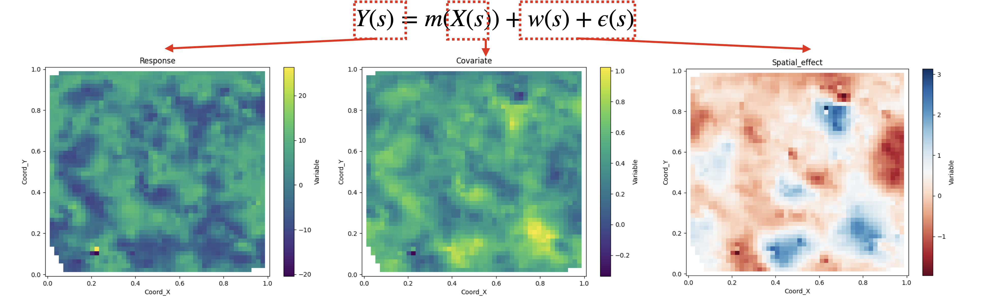
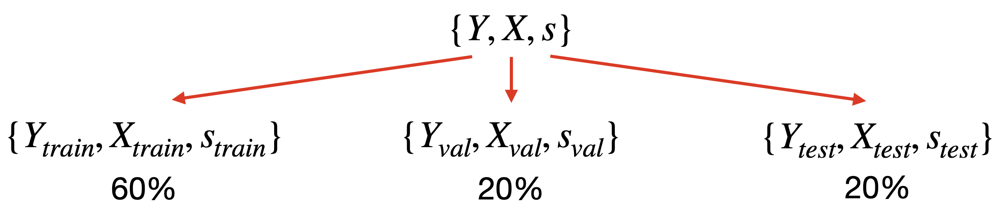
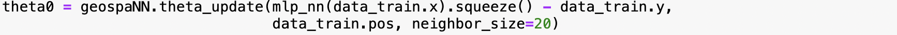
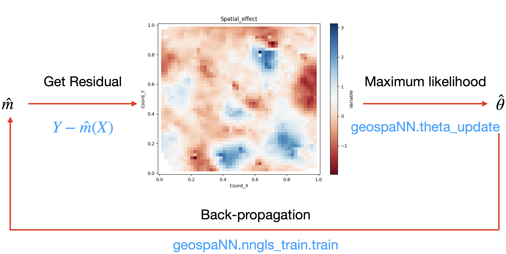
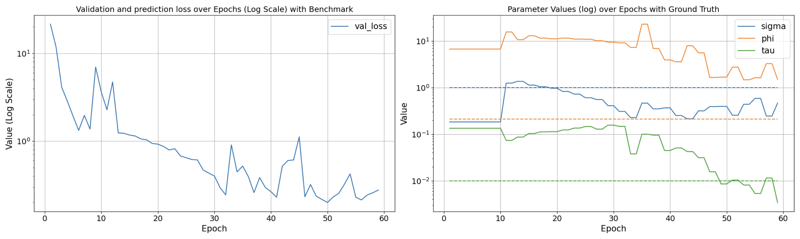
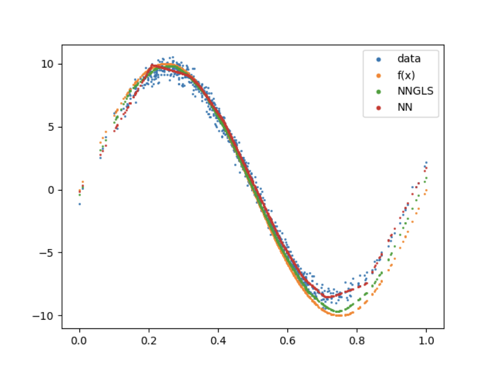
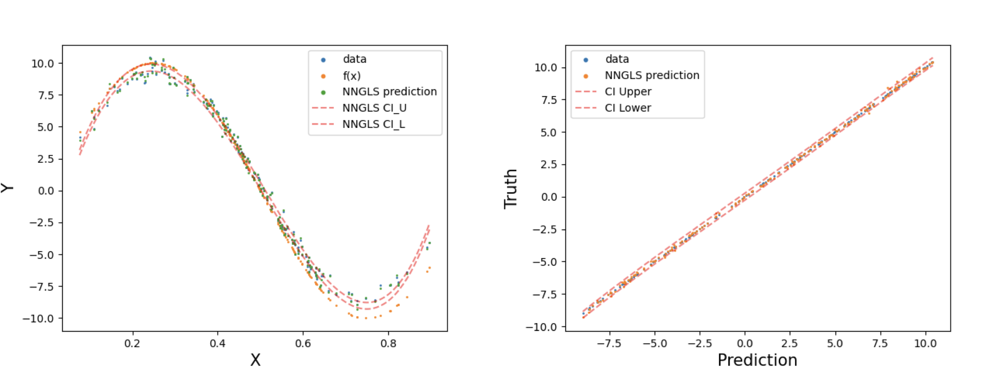
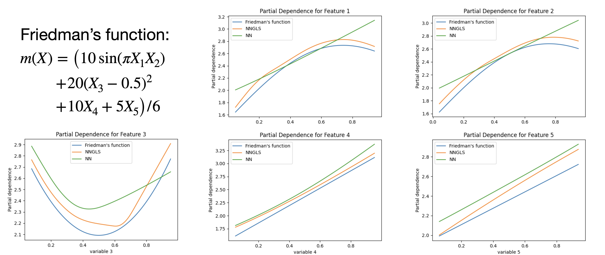

---
output:
  pdf_document: default
  html_document: default
---

\ 

\centerline{\textbf{\Huge Vignette for GeospaNN}}

\ 

# 1 Summary {#sec-intro}

**GeospaNN** stands for **Geo**spatial **N**eural **N**etworks and is a package that implements NN-GLS, a geographically-informed Graph Neural Network (GNN) architecture. This file provides a brief introduction on how to use GeospaNN for geospatial data analysis. The vignette is divided into three parts:

-   **Data preparation:** This section covers features that transform raw geospatial data into the input format for the Neural Network trainer. It also introduces a geospatial simulation function for conducting general statistical experiments.
-   **Model training:** This section explains the main functions used to train the model. To streamline the common training procedure, a user-friendly trainer is introduced for NN-GLS.
-   **Model evaluation:** This section visualizes the training process and spatial parameter estimation. It also provides functions for mean-effect estimation and new-location prediction, which are the primary goals of the package and can support various geospatial applications.

In addition to this vignette, GeospaNN's official website [(https://wentaozhan1998.github.io/geospaNN-doc/)](https://wentaozhan1998.github.io/geospaNN-doc/) offers an installation guide, comprehensive documentation, and several statistical experiments. The demo code for this vignette is available at [(https://wentaozhan1998.github.io/geospaNN-doc/Example_utils/Example_utils/)](https://wentaozhan1998.github.io/geospaNN-doc/Example_utils/Example_utils/).

# 2 Main Content

We will start by loading the `geospaNN` and other dependencys for this vignette:
```{python, eval = FALSE}
import torch
import geospaNN
import numpy as np
import time
import pandas as pd
import seaborn as sns
import random

import matplotlib
import matplotlib.pyplot as plt

path = '../data/Output/'
```

## 2.1 Spatial Mixed Effect Model (SPMM) and Goal

In this vignette, we focus on the spatial mixed effect model, formulated as: $$ 
Y(s) = m\big(X(s)\big) + w(s) + \epsilon(s), 
$$ where:

-   $X(s)$ are the spatial covariates at location $s$,
-   $Y(s)$ is the observed variable,
-   $\epsilon(s)$ is the i.i.d. random Gaussian noise following $N(0, \tau\sigma^2)$, also known as the nugget in spatial literature,
-   $w(s)$ represents a stochastic process accounting for spatial correlation, modeled as a mean-zero exponential Gaussian Process (GP) with the following covariance structure: $$
    \text{cov}\big(w(s_1), w(s_2)\big) = C(s_1, s_2|\theta) = \sigma^2\exp\left(-\phi\|s_1 - s_2\|^2\right).
    $$ Here, $\theta$ is introduced as a general notation for $(\sigma^2, \phi, \tau)$. Under this setting, geospaNN aims to estimate the non-linear mean effect $m(\cdot)$ by $\hat{m}(\cdot)$ falling in the Neural Network family (estimation task), as well as predict the response $y(s_{new})$ at new locations $s_{new}$ by combining the mean estimation $\hat{m}(\cdot$ and the kriging prediction $\hat{w}(s_{new})$. Nearest Neighbor Gaussian Process (NNGP) [Datta et al., 2016] is used as an approximate process to the full GP, ensuring the scalability of GeospaNN. This enables analysis on geospatial datasets with up to 1 million observations.

## 2.2 Simulation and Data Preprocessing

### 2.2.1 Simulation

Simulation is a key feature of **GeospaNN**, enabling the generation of geospatial datasets for various experiments and facilitating methodology development with flexibility and efficiency. Simulating spatially correlated data typically requires $O(n^3)$ running time due to the need to compute the Cholesky factor of an $n \times n$ covariance matrix and multiply it with i.i.d. random effects. However, **NNGP** provides efficient precision matrix computation and Cholesky factorization, reducing the time complexity to $O(n)$ for large sample sizes.

In this section, we simulate data from the model described earlier. Specifically, we use the function `funXY`:

$$
m(x) = 10\sin(2\pi x).
$$

The simulation setup includes:

-   The spatial effect $w(s)$, generated as an exponential Gaussian process with spatial variance $\sigma^2 = 1$ (`sigma`) and spatial correlation decay $\phi = 3\sqrt{2}/20$ (`phi`).
-   The i.i.d. random noise $\epsilon(s)$, with variance $\eta^2 = \tau \cdot \sigma^2 = 0.01$ (`tau`).

Additional required parameters include:

-   Sample size (`n`): The desired number of samples.
-   Number of covariates (`p`): The number of predictors.
-   Number of neighbors (`nn`): Used for NNGP approximation.
-   Range of spatial locations (`range`): Specifies the 2D domain $[\texttt{range}]^2$ from which spatial locations are sampled.

The function returns the following in tensor formats: the coordinates \texttt{X}, response \texttt{Y}, coordinates \texttt{coord}, covariance matrix \texttt{cov}, and random effect $w(s) + \epsilon(s)$ \texttt{corerr}.

```{python, eval = FALSE}
def f1(X): return 10 * np.sin(2*np.pi * X)

p = 1;
funXY = f1

n = 1000
nn = 20
batch_size = 50

sigma = 1
phi = 0.3
tau = 0.01
theta = torch.tensor([sigma, phi / np.sqrt(2), tau])

X, Y, coord, cov, corerr = geospaNN.Simulation(n, p, nn, funXY, theta, range=[0, 1])
```

### 2.2.2 Practical Simulation Approach

In practice, the covariate $X$ itself is often spatially correlated (denoted as $X(s)$). A practical shortcut for simulating in this setting involves:

1.  Using `geospaNN.Simulation` to generate one correlated spatial process `corerr` as $X(s)$.
2.  Generating another `corerr` as $w(s) + \epsilon(s)$.
3.  Assembling $Y$ as $m\big(X(s)\big) + w(s) + \epsilon(s)$.

The process is illustrated in the following code chunks, and Figure 1 visualizes the simulated data.

```{python, eval = FALSE}
#1
_, _, _, _, X = geospaNN.Simulation(n, p, nn, funXY, torch.tensor([1, 5, 0.01]), range=[0, 1])
X = X.reshape(-1,p)
X = (X - X.min())/(X.max() - X.min())
#2
_, _, coord, cov, corerr = geospaNN.Simulation(n, p, nn, funXY, theta, range=[0, 1])
#3
Y = funXY(X).reshape(-1) + corerr
```


### 2.2.3 Data Preprocessing

Covariates $X$ ($n \times p$), response $Y$ ($n \times 1$), and coordinates $s$ ($n \times 2$) form the fundamental elements of a geospatial dataset. However, to prepare the dataset for a GNN module, a directed graph must be constructed using the `geospaNN.make_graph` function. This function creates a `DataLoader` object for efficient data loading and management. In addition to `X`, `Y`, and `coord`, it requires:

-   The number of nearest neighbors (`nn`), since the function vonstructs a $k$-nearest-neighbor graph by default, with $k$ specified by `nn`.
-   An $n \times k$ index tensor `Ind_list`, which allows customization of the graph using. The $i$-th row contains the indices of nodes connected to $s_i$, with `-1` indicating no connection.
```{python, eval = FALSE}
data = geospaNN.make_graph(X, Y, coord, nn, Ind_list = None)
```
Additionally, **training-validation-testing split** is simplified using the `geospaNN.split_data` function. Like `geospaNN.make_graph`, this function takes covariates $X$, response $Y$, coordinates $s$, and neighbor size as inputs. Users can customize the split proportions with `val_proportion` and `test_proportion`, both defaulting to 0.2. The output includes three `DataLoader` objects required for the training process.

```{python, eval = FALSE}
data_train, data_val, data_test = geospaNN.split_data(X, Y, coord,neighbor_size=nn,                                                           test_proportion=0.2,                                                                    val_proportion=0.2)
```


## 2.3 Model Training

After preprocessing the data, geospaNN fits the model in two steps:

1.  **Initialize the spatial parameters**.
2.  **Fit NN-GLS**.

### 2.3.1 Parameter Initialization

Initializing the spatial parameters $\theta$ is necessary for training NN-GLS since L-BFGS-based likelihood maximum-likelihood estimation is employed to iteratively update $\theta$. A reasonable initial guess is crucial to a successful training because the GLS-style loss function is sensitive to these spatial parameters.

Unless in special cases where initial value is available, users are encouraged to follow our default pipeline, where $\theta$ is initialized as the maximum likelihood estimator from NN-based residual `theta0` (can be obtained without any spatial parameters).
```{python, eval = FALSE}
mlp_nn = torch.nn.Sequential(
    torch.nn.Linear(p, 100),
    torch.nn.ReLU(),
    torch.nn.Linear(100, 50),
    torch.nn.ReLU(),
    torch.nn.Linear(50, 20),
    torch.nn.ReLU(),
    torch.nn.Linear(20, 1),
)
trainer_nn = geospaNN.nn_train(mlp_nn, lr=0.01, min_delta=0.001)
training_log = trainer_nn.train(data_train, data_val, data_test, seed = 2025)
theta0 = geospaNN.theta_update(mlp_nn(data_train.x).squeeze() - data_train.y, 
                               data_train.pos, neighbor_size=20)
```


### 2.3.2 Fit NN-GLS

With `theta0` being the initial value, the model is fitted as following:
```{python, eval = FALSE}
mlp_nngls = torch.nn.Sequential(
    torch.nn.Linear(p, 100),
    torch.nn.ReLU(),
    torch.nn.Linear(100, 50),
    torch.nn.ReLU(),
    torch.nn.Linear(50, 20),
    torch.nn.ReLU(),
    torch.nn.Linear(20, 1),
)
model = geospaNN.nngls(p=p, neighbor_size=nn, coord_dimensions=2, mlp=mlp_nngls, 
                       theta=torch.tensor(theta0))
trainer_nngls = geospaNN.nngls_train(model, lr=0.1, min_delta=0.001)
training_log = trainer_nngls.train(data_train, data_val, data_test, epoch_num= 200, 
                                   Update_init=10, Update_step=2, seed = 2025)
```
The code chunk consists of 4 steps:

1.  **Step 1**: Define the non-spatial architecture. Here we defined a 3-layer multi-layer perceptron (MLP) through `torch.nn.Sequential`).
2.  **Step 2**: Define the NN-GLS model with the MLP defined in step 1 and an initialized exponential Gaussian covariance structure specified by `theta0` using `geospaNN.nngls`, which requires:
    -   Number of covariates (`p`).
    -   Number of nearest neighbors (`neighbor_size`).
    -   Dimension of spatial coordinates (`coord_dimensions`).
    -   Nonspatial architecture (`mlp_nngls`).
    -   Spatial parameters (`theta`).
3.  **Step 3**: Define a trainer for NNGLS through `geospaNN.nngls_train`, which requires:
    -   Learning rate (`lr`): we recommend values in the range of $[0.01, 0.1]$ for our default ADMM optimizer.
    -   Minimum value of validation loss drop (`min_delta`): any decrease of validation loss from last epoch larger than this value will be recorded as "significant gain." If no significant gain happens in the last few epochs, early stopping will be triggered.
4.  **Step 4**: Run the trainer with the dataloaders, which requires:
    -   Dataloaders for training, validation, and testing (`data_train`, `data_val`, `data_test`).
    -   Maximum number of epochs (`epoch_num`).
    -   Initial epoch for spatial parameter estimation (`Update_init`).
    -   Number of epochs between two spatial parameter updates (`Update_step`).

### 2.3.3 Iterative Parameter Update

We note that in training NN-GLS, we isolate the spatial parameters $\theta$'s update from the other weights parameters in the non-spatial architecture and update them iteratively as is demonstrated in figure 4. We control the frequency and starting point of updating $\theta$ to improve the efficiency and stability of the training. In general cases, the property of a SPMM is dominated by its spatial structure (i.e. $\theta$). If $\theta$ is updated when the non-spatial estimation is still unstable and biased, the new $\theta$ will be significantly affected, a vicious cycle will form as $\theta$ deviating further from the truth and cause non-convergence.


## 2.4 Result Output

Our pipeline returns the outputs in the following aspects:

-   The performance of training.
-   The model-related performance, including prediction at new locations and mean effect estimation.
-   Visualization tools for the functions mentioned above.

### 2.4.1 Performance of Training

To evaluate how geospaNN performed in the training process, use `geospaNN.plot_log` which requires:

-   Optional true spatial parameters (`theta`).
-   Path to save the figure (`path`).

```{python, eval = FALSE}
geospaNN.plot_log(training_log, theta, path, save = True)
```


### Mean Function Estimation

Mean function estimation corresponds to the $m(x)$ term in SPMM model, which represents the non-spatial relationship between $Y$ and covariates $X$. To obtain the mean function estimation for covariates `X`, use the following method:
```{python, eval = FALSE}
estimate = model.estimate(X)
```
```{r, echo=FALSE, fig.align='center', out.width='50%', out.height='50%', fig.cap="Mean Function Estimation"}

```

Note that for the NN-GLS model, the mean function is estimated by the non-spatial architecture `mlp_nngls`, or can be equivalently called by `model.mlp`. Thus, `model.estimate(X)` is equivalent to `model.mlp(X)` and `mlp_nngls(X)`. Additional code to produce the figure used the `matplotlib` library and is shown in Appendix chunk 1.

### 2.4.2 Prediction and Intervals

To predict, use `geospaNN.predict()` as follows:
```{python, eval = FALSE}
[test_predict, test_CI_U, test_CI_L] = model.predict(data_train, data_test, CI = True)
```


NNGLS provides prediction and 95% confidence intervals by kriging. For new location(s) $s_{new}$ and covariates $X(s_{new})$, prediction is obtained as:

$$
\hat{Y}(s_{new}) = \hat{m}\big(X(s_{new})\big) + \hat{w(s_{new}) + \epsilon(s_{new})}.
$$

The first term is deterministic and computed as mean function estimation. The second term is assumed a spatial process and incorporates uncertainty. In our model, conditioning on the training set, the spatial effect on new locations follows a Gaussian distribution whose mean and variance are obtained through kriging. Nearest neighbor kriging (NNGP approximation) is utilized here to guarantee the scalability of prediction. Additional code to produce the figure used the `matplotlib` library and is shown in Appendix chunks 2 and 3.

### 2.4.3 Partial Dependency Plot

If we switch the 1-dimensional sine function used through this vignette to the 5-dimensional Friedman's function and run the same pipeline, the PDP can be generated by using `geospaNN.visualize.plot_PDP_list`.
```{python, eval = FALSE}
geospaNN.visualize.plot_PDP_list([funXY, mlp_nngls, mlp_nn], 
                                 ['Friedmans function', 'NNGLS', 'NN'], 
                                 X, split = True)
```


Partial Dependency Plot (PDP) is a commonly used visualization tool in the machine learning community to illustrate the marginal effect of a single covariate on the response for a high-dimensional model. Given a multi-dimensional function $m(X)$ and one covariate $X_i$, its PDP is generated by numerically integrating out the other covariates via:

$$
PD(m, X_i) = \int m(X_1, \cdots, X_p)P(X_{-i})dX_{-i}.
$$

The code chunk above just provides an illustration for the usage of PDP, and won't work for the 1-D example in this vignette. A full PDP script is available at [https://abhirupdatta.github.io/geospatial_stats_ML_short_course_2024/lec_code/lec4_ibc/PDP.ipynb](https://abhirupdatta.github.io/geospatial_stats_ML_short_course_2024/lec_code/lec4_ibc/PDP.ipynb) for more details.

------------------------------------------------------------------------

## Appendix

Chunk 1
```{python, eval = FALSE}
plt.clf()
plt.scatter(X.detach().numpy(), Y.detach().numpy(), s=1, label='data')
plt.scatter(X.detach().numpy(), funXY(X.detach().numpy()), s=1, label='f(x)')
plt.scatter(X.detach().numpy(), estimate, s=1, label='NNGLS')
plt.scatter(X.detach().numpy(), mlp_nn(X).detach().numpy(), s=1, label='NN')
lgnd = plt.legend()
```

Chunk 2
```{python, eval = FALSE}
x_np = data_test.x.detach().numpy().reshape(-1)
x_smooth = np.linspace(x_np.min(), x_np.max(), 200)  # Create finer x-points
degree = 4
U_fit = np.polyfit(x_np, test_CI_U, degree)
L_fit = np.polyfit(x_np, test_CI_L, degree)
Pred_fit = np.polyfit(x_np, test_predict, degree)

# Evaluate the polynomial on a smooth grid
y_smooth_U = np.polyval(U_fit, x_smooth)
y_smooth_L = np.polyval(L_fit, x_smooth)
y_smooth = np.polyval(Pred_fit, x_smooth)

plt.clf()
plt.scatter(data_test.x.detach().numpy(), data_test.y.detach().numpy(), s=1, label='data')
plt.scatter(data_test.x.detach().numpy(), funXY(data_test.x.detach().numpy()), s=1, label='f(x)')
plt.scatter(data_test.x.detach().numpy(), test_predict.detach().numpy(), s=1, label='NNGLS prediction')
plt.plot(x_smooth, y_smooth_U, linestyle='--', label='NNGLS CI_U', color = 'red', alpha = 0.5)
plt.plot(x_smooth, y_smooth_L, linestyle='--', label='NNGLS CI_L', color = 'red', alpha = 0.5)
plt.xlabel("X", fontsize=15)
plt.ylabel("Y", fontsize=15)
lgnd = plt.legend()
```

Chunk 3
```{python, eval = FALSE}
plt.clf()
plt.scatter(data_test.x.detach().numpy(), data_test.y.detach().numpy(), s=1, label='data')
plt.scatter(data_test.x.detach().numpy(), funXY(data_test.x.detach().numpy()), s=1, label='f(x)')
plt.scatter(x_smooth, y_smooth, s=1, label='NNGLS prediction')
plt.plot(x_smooth, y_smooth_U, linestyle='--', label='NNGLS CI_U', color = 'red', alpha = 0.5)
plt.plot(x_smooth, y_smooth_L, linestyle='--', label='NNGLS CI_L', color = 'red', alpha = 0.5)
plt.xlabel("X", fontsize=15)
plt.ylabel("Y", fontsize=15)
lgnd = plt.legend()
```
